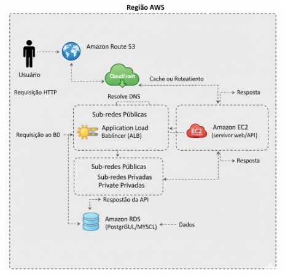

# Projeto Bootcamp Santnader Code Girls - Gerenciando Instancias EC2 AWS

Este diagrama representa uma arquitetura básica e escalável para uma aplicação web/API na AWS.

### 1. Usuário e Requisição Inicial

* **Usuário:** Inicia o processo acessando o nome de domínio da sua aplicação (ex: `www.minhaaplicacao.com`).
* **Requisição HTTP:** A requisição é enviada para a internet.

### 2. Amazon Route 53 (DNS)

* **Função:** O Route 53 é o serviço de DNS (Domain Name System) gerenciado da AWS. Ele atua como uma "lista telefônica" para a internet.
* **Fluxo:** Quando a requisição chega, o Route 53 resolve o DNS, ou seja, ele traduz o nome de domínio (ex: `www.minhaaplicacao.com`) para um endereço IP. Neste caso, ele aponta para o CloudFront.

### 3. Amazon CloudFront (CDN)

* **Função:** O CloudFront é um serviço de CDN (Content Delivery Network). Ele armazena em cache cópias do seu conteúdo (arquivos estáticos, imagens, vídeos, etc.) em "pontos de presença" (Edge Locations) geograficamente próximos aos seus usuários.
* **Fluxo:**
    * Se o conteúdo solicitado pelo usuário estiver em cache no CloudFront (ex: arquivos `JavaScript`, `CSS`), ele é entregue diretamente ao usuário a partir do Edge Location mais próximo, proporcionando baixa latência e alta velocidade.
    * Se o conteúdo não estiver em cache ou for uma requisição dinâmica (para a API), o CloudFront atua como um roteador, encaminhando a requisição para o próximo ponto na arquitetura: o Application Load Balancer.

### 4. Application Load Balancer (ALB) - Em Sub-redes Públicas

* **Função:** O ALB distribui o tráfego de entrada entre várias instâncias EC2, garantindo alta disponibilidade e escalabilidade. Ele opera na camada 7 (aplicação) do modelo OSI, o que permite um roteamento mais inteligente baseado no conteúdo da requisição.
* **Localização:** Geralmente reside em **Sub-redes Públicas** dentro da VPC, pois precisa ter um IP acessível pela internet (ou pelo CloudFront, neste caso).
* **Fluxo:** O ALB recebe a requisição do CloudFront e a encaminha para uma das instâncias EC2 saudáveis que estão configuradas em seu grupo de destino.

### 5. Amazon EC2 (Servidor Web/API) - Em Sub-redes Privadas

* **Função:** As instâncias EC2 (Elastic Compute Cloud) são servidores virtuais onde sua aplicação web (frontend e/ou backend/API) é executada.
* **Localização:** É uma boa prática de segurança colocar as instâncias EC2 que contêm a lógica da sua aplicação em **Sub-redes Privadas**. Isso significa que elas não têm acesso direto da internet, apenas através do ALB.
* **Fluxo (Requisição):** A instância EC2 recebe a requisição do ALB e processa a lógica da aplicação. Se precisar de dados, ela fará uma requisição ao banco de dados.

### 6. Amazon RDS (Banco de Dados) - Em Sub-redes Privadas

* **Função:** O Amazon RDS (Relational Database Service) é um serviço de banco de dados relacional gerenciado. Ele suporta motores como PostgreSQL, MySQL, SQL Server, Oracle, etc. A AWS cuida da infraestrutura, backups, patches e escalabilidade.
* **Localização:** O RDS deve **sempre** ser colocado em **Sub-redes Privadas**. Ele não deve ter acesso direto da internet para garantir a segurança dos seus dados. Apenas as instâncias EC2 autorizadas dentro da mesma VPC podem se comunicar com ele.
* **Fluxo:** O EC2 faz uma requisição ao BD para buscar ou persistir dados. O RDS retorna os dados para a instância EC2.

### 7. Fluxo de Resposta

* A instância EC2, com os dados do RDS, gera a resposta da API (ou a página HTML renderizada).
* Essa resposta é enviada de volta para o ALB.
* O ALB a repassa para o CloudFront.
* O CloudFront pode optar por armazenar essa resposta em cache (se aplicável) e a entrega de volta ao Usuário.
